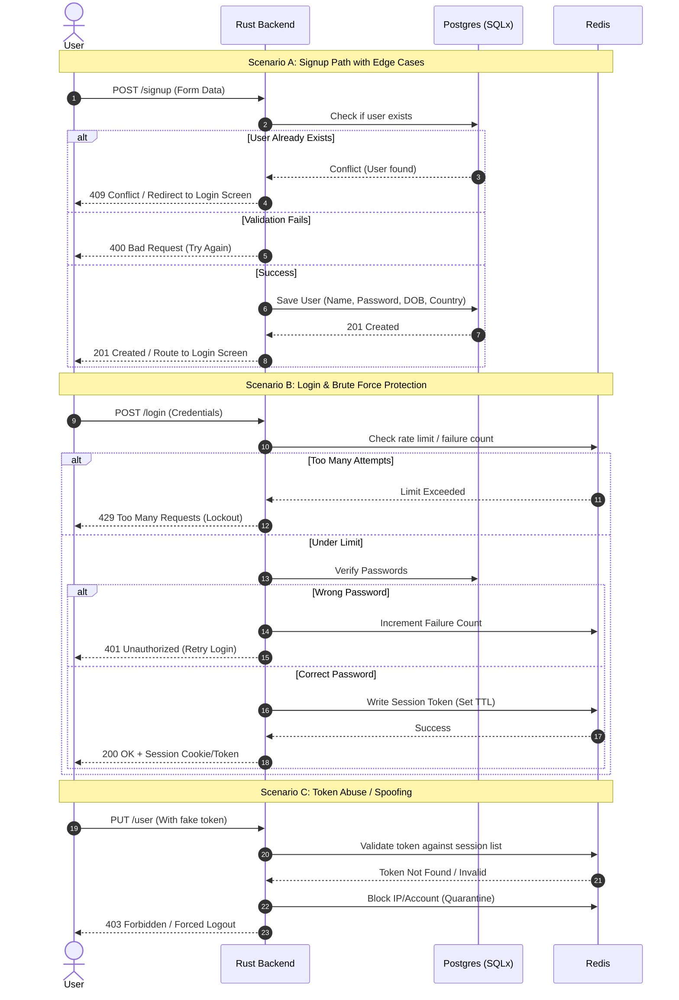

# Secure Authentication & Session Lifecycle Backend

This project is a robust, production-ready authentication and user management system proudly built with Rust. This backend is engineered from the ground up with defensive design patterns, high-concurrency optimizations, compile-time safety, and comprehensive observability.

The system relies on a dual-layer storage strategy—utilizing **Postgres** for persistent user data and **Redis** for fast, reliable session management—while explicitly preparing the codebase to gracefully withstand heavy loads and distributed stress.

| Endpoint          | Test Type                                                                    | Max Concurrent VUs | Target Throughput | p(95) Latency | Status / Bottleneck      |
| :---------------- | :--------------------------------------------------------------------------- | :----------------- | :---------------- | :------------ | :----------------------- |
| **POST** `/users` | [Load Test](./load_tests/benchmarks/signup_scenario_tests_summary.json)      | 50 VUs             | 170 req/s         | 415ms         | Pass (Release Profile)   |
| **POST** `/users` | [Scale Peak](./load_tests/benchmarks/signup_scenario_66vu_peak_summary.json) | 66 VUs             | 221 req/s         | 450.0ms       | Pass (Maximum Safe Load) |
| **POST** `/users` | [Stress Test](./load_tests/benchmarks/signup_stress_90vu_break.json)         | 90 VUs             | 236 req/s         | 749ms         | **Fails Threshold**      |

Check out more about the [benchmarks](./load_tests/benchmarks/)


---

## System Architecture

To understand the internal lifecycles, defensive guardrails, and API transitions of this system before diving into the code, refer to our structural sequence diagram below:



---

## Getting Started

### 1. Initialize the Infrastructure

A dedicated initialization script is provided to spin up and configure your local environment dependencies (such as the database container - authpracticedb ) seamlessly.

```bash
./scripts/init_db.sh

```

### 2. High-Response Local Development Loop

For a rapid feedback loop on code changes, utilize `cargo watch` to automatically trigger check routines and binary execution on save:

```bash
cargo watch -x check -x run

```

### 3. Local Testing

To run tests:

```bash
cargo test

```

---

## Development Methodology

This project strictly adheres to **Test-Driven Development (TDD)** utilizing the **Red, Green, Refactor** workflow loop:

1.  **Red:** Write an intentional unit or integration test defining the expected behavior before writing any feature code, ensuring the test fails.
2.  **Green:** Implement the minimum necessary production code required to make the test pass successfully.
3.  **Refactor:** Clean up the implementation, optimize performance, and align architectural abstractions while keeping the test suite green.

---

## Project Scope & Specifications

- **In Scope:** \* Full CRUD operational capability for users.
- Robust relational data persistence mapping: `UserName`,`Email`, `Password`, `Date-of-Birth`, and `Date-Created`.
- Heavy-concurrency stress testing to isolate code/database connection limits and prevent Denial of Service (DoS) vectors.

- **Out of Scope:** \* External asynchronous message loops such as third-party email verification. This project implements pure, high-performance token-based authentication.

---

## Implementation Roadmap

### Phase 1: Infrastructure & Health Diagnostics

- [ ] Write a unit test for the system health check endpoint.
- [ ] Implement a lightweight `GET /health_check` endpoint to verify initial application bootstrap and availability.

### Phase 2: Core Authentication Modules

- [ ] Implement secure User Sign-Up flow accompanied by strict validation unit tests.
- [ ] Implement User Login flow with companion session verification unit tests.
- [ ] Implement Profile Update (`PUT /user`) capabilities with isolated unit tests.
- [ ] Implement Account **_Soft_** Deletion (`DELETE /user`) routines with companion unit tests.

### Phase 2(b): Storage & Dockerization

- [ ] Write comprehensive integration tests for the database layer to definitively verify that storage, updates, and soft deletion behave as expected under real transactions.
- [ ] Fully containerize the application environment and decouple database dependencies via Docker containers.
- [ ] Persist structural user fields securely within a PostgreSQL relational schema.

### Phase 3: High-Load Stress Testing & Optimization

- [ ] **Conduct stress and load testing on authentication endpoints:** Simulate high-concurrency spikes on `/signup` and `/login` (including rapid consecutive requests from single sources). Identify performance bottlenecks, ensure the server maintains availability under heavy load, and implement optimizations or rate-limiting where necessary.

---

## Instructions to run the project

To run the project simply run:

```bash
 docker compose up -d
```

Then run the following to apply migrations before proceeding with further exploration:

```bash
 sqlx migrate run
```
