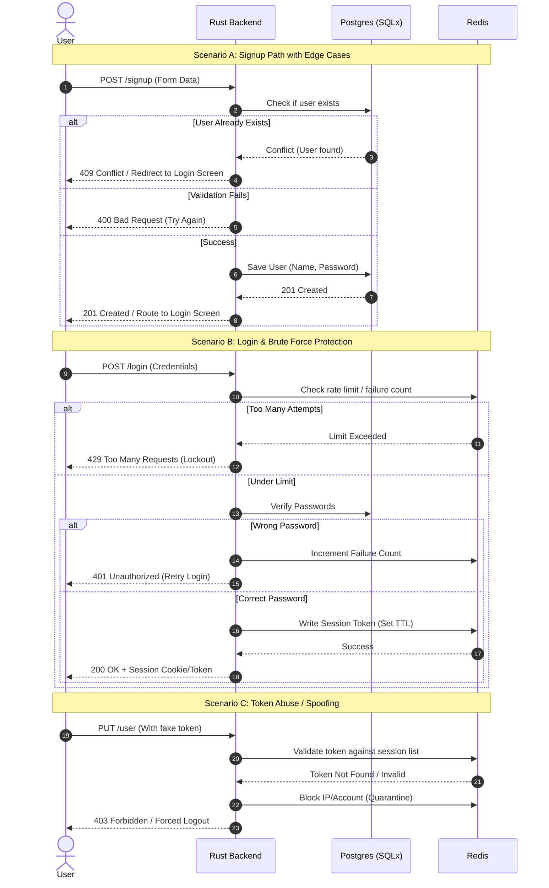

# Secure Authentication & Session Lifecycle Backend

This project is a robust, production-ready authentication and user management system proudly built with Rust. This backend is engineered from the ground up with defensive design patterns, high-concurrency optimizations, compile-time safety, and comprehensive observability.

The system relies on a dual-layer storage strategy—utilizing **Postgres** for persistent user data and **Redis** for fast, reliable session management—while explicitly preparing the codebase to gracefully withstand heavy loads and distributed stress.

| Endpoint          | Test Type                                                                    | Max Concurrent VUs | Target Throughput | p(95) Latency | Status / Bottleneck      |
| :---------------- | :--------------------------------------------------------------------------- | :----------------- | :---------------- | :------------ | :----------------------- |
| **POST** `/users` | [Load Test](./load_tests/benchmarks/signup_scenario_tests_summary.json)      | 50 VUs             | 170 req/s         | 415ms         | Pass (Release Profile)   |
| **POST** `/users` | [Scale Peak](./load_tests/benchmarks/signup_scenario_66vu_peak_summary.json) | 66 VUs             | 221 req/s         | 450.0ms       | Pass (Maximum Safe Load) |
| **POST** `/users` | [Stress Test](./load_tests/benchmarks/signup_stress_90vu_break.json)         | 90 VUs             | 236 req/s         | 749ms         | **Fails Threshold**      |
| **POST** `/auth`  | [Load Test](./load_tests/benchmarks/login_scenario_tests_summary.json)       | 50 VUs             | 193 req/s         | 348ms         | **Pass**                 |

Check out more about the [benchmarks](./load_tests/benchmarks/)
Disclaimer: These benchmarks were executed on a local development machine under real-world conditions with significant background process overhead (CPU/memory contention). In an isolated, production-grade, or "noiseless" environment, latency figures and throughput thresholds for Actix Web are expected to be significantly lower and higher, respectively.

---

## System Architecture

To understand the internal lifecycles, defensive guardrails, and API transitions of this system before diving into the code, refer to our structural sequence diagram below:



---

## Development Methodology

This project strictly adheres to **Test-Driven Development (TDD)** utilizing the **Red, Green, Refactor** workflow loop:

1.  **Red:** Write an intentional unit or integration test defining the expected behavior before writing any feature code, ensuring the test fails.
2.  **Green:** Implement the minimum necessary production code required to make the test pass successfully.
3.  **Refactor:** Clean up the implementation, optimize performance, and align architectural abstractions while keeping the test suite green.

---

## Project Scope & Specifications

- **In Scope:** \* Full CRUD operational capability for users.
- Robust relational data persistence mapping: `UserName`,`Email`, `Password`, `Date-of-Birth`, and `Date-Created`.
- Heavy-concurrency stress testing to isolate code/database connection limits and prevent Denial of Service (DoS) vectors.

- **Out of Scope:** \* External asynchronous message loops such as third-party email verification. This project implements pure, high-performance token-based authentication.

---

## Implementation Roadmap

### Phase 1: Infrastructure & Health Diagnostics

- [x] Write a unit test for the system health check endpoint.
- [x] Implement a lightweight `GET /health_check` endpoint to verify initial application bootstrap and availability.

### Phase 2: Core Authentication Modules

- [x] Implement secure User Sign-Up flow accompanied by strict validation unit tests.
- [ ] Implement User Login flow with companion session verification unit tests.
- [ ] Implement Profile Update (`PUT /user`) capabilities with isolated unit tests.
- [ ] Implement Account **_Soft_** Deletion (`DELETE /user`) routines with companion unit tests.

### Phase 2(b): Storage & Dockerization

- [ ] Write comprehensive integration tests for the database layer to definitively verify that storage, updates, and soft deletion behave as expected under real transactions.
- [ ] Fully containerize the application environment and decouple database dependencies via Docker containers.
- [ ] Persist structural user fields securely within a PostgreSQL relational schema.

### Phase 3: High-Load Stress Testing & Optimization

- [ ] **Conduct stress and load testing on authentication endpoints:** Simulate high-concurrency spikes on `/signup` and `/login` (including rapid consecutive requests from single sources). Identify performance bottlenecks, ensure the server maintains availability under heavy load, and implement optimizations or rate-limiting where necessary.

---

## Getting Started

### 1. Initialize the Infrastructure

The project has a couple of moving pieces, for that reason I opted to have a section here to take someone who is new through how they would set up the project.

## Local Development & Observation Ecosystem

This project is fully instrumented for performance testing. It leverages a localized telemetry stack (Prometheus, Loki, Grafana) to analyze application bottlenecks under simulated loads.

---

### 1. Quick Start Infrastructure Loop

To get the core containers, third-party mocks, and telemetry suites up and running, follow this sequence:

```bash
# Step A: Initialize core database configurations & containers; This one will be useful for cargo test
./scripts/init_db.sh

# Step B: Spin up the telemetry and mock service ecosystem
docker compose up -d

# Step C: Manually run your database schema migrations
# Open to hearing ways to shortcircuit this so that we dont have to remember to run it every time.
sqlx migrate run
```

> **Important:** Always ensure `docker compose up -d` has finished initializing the Postgres cluster completely before executing `sqlx migrate run` on your host machine.

---

### 2. High-Response Local Development

For a rapid feedback loop on code changes, run `cargo watch` on your host machine. This binds directly to your local Postgres port (`127.0.0.1:5432`) as configured in your `.env` file:

```bash
cargo watch -x check -x run

```

---

### 3. Verification & Testing

Our endpoints are verified via a hermetic mock environment using a local WireMock service (`hibp-mock`) to simulate third-party API limits safely.
I opted specifically for this because otherwise we would basically be assaulting the official hibp server when load testing with k6, even if we insisted on using that we would need to grab a pta (Permission to attack) which just costs us more time than just straight up simulating it ourselves. At the end of the day we just care to test if a delay caused by a network io operation bars other users early on.

```bash
# Run the native test suites
# Make sure you have run ./scripts/init_db.sh first which will make the db which we would need for this.
cargo test

```

---

### 4. Telemetry & Observation Control Center

Once your environment is up, you can monitor system behavior, log traces, and runtime performance histograms in real-time at the following endpoints:

| Service           | Local URL                                                                      | Default Credentials | Purpose                            |
| ----------------- | ------------------------------------------------------------------------------ | ------------------- | ---------------------------------- |
| **Grafana**       | [http://localhost:3000](https://www.google.com/search?q=http://localhost:3000) | `admin` / `admin`   | Unified Metrics & Loki Log Panels  |
| **Prometheus**    | [http://localhost:9090](https://www.google.com/search?q=http://localhost:9090) | _None_              | Raw Metrics Scraper Hub            |
| **cAdvisor**      | [http://localhost:8080](https://www.google.com/search?q=http://localhost:8080) | _None_              | Real-time Container Resource Stats |
| **Node Exporter** | [http://localhost:9100](https://www.google.com/search?q=http://localhost:9100) | _None_              | Host Machine Hardware Diagnostics  |

### Tracking Errors in Grafana Explore

1. Navigate to **Grafana Explore** (`http://localhost:3000/explore`).
2. Select the **Loki** data source.
3. Paste the following LogQL query into the query box to extract your fields and cleanly translate Bunyan's numeric logging dictionary into standard text severities (`info`, `warn`, `error`):

```logql
{container="auth-practice-app-1"} | json | label_format level=`{{ if eq .level "30" }}info{{ else if eq .level "40" }}warn{{ else if eq .level "50" }}error{{ else }}fatal{{ end }}`

```

4. Expand any specific failing log line inside the dashboard drawer to locate its unique transaction **`request_id`** (e.g., `76b9875a-b690-4f14-a8a4-33bde98bd685`).
5. Isolate that ID using `|= "YOUR_REQUEST_ID"` to reconstruct the chronological timeline of exactly what that thread did across your framework spans!
