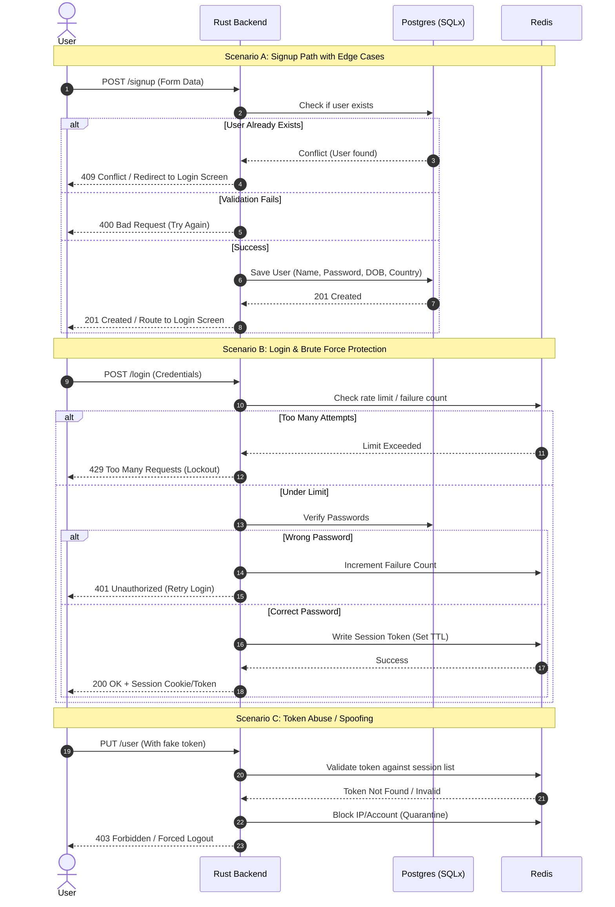

```mermaid
sequenceDiagram
    autonumber
    actor User
    participant API as Rust Backend
    participant PG as Postgres (SQLx)
    participant RD as Redis

    Note over User, RD: Scenario A: Signup Path with Edge Cases
    User->>API: POST /signup (Form Data)
    API->>PG: Check if user exists
    alt User Already Exists
        PG-->>API: Conflict (User found)
        API-->>User: 409 Conflict / Redirect to Login Screen
    else Validation Fails
        API-->>User: 400 Bad Request (Try Again)
    else Success
        API->>PG: Save User (Name, Password, DOB, Country)
        PG-->>API: 201 Created
        API-->>User: 201 Created / Route to Login Screen
    end

    Note over User, RD: Scenario B: Login & Brute Force Protection
    User->>API: POST /login (Credentials)
    API->>RD: Check rate limit / failure count
    alt Too Many Attempts
        RD-->>API: Limit Exceeded
        API-->>User: 429 Too Many Requests (Lockout)
    else Under Limit
        API->>PG: Verify Passwords
        alt Wrong Password
            API->>RD: Increment Failure Count
            API-->>User: 401 Unauthorized (Retry Login)
        else Correct Password
            API->>RD: Write Session Token (Set TTL)
            RD-->>API: Success
            API-->>User: 200 OK + Session Cookie/Token
        end
    end

    Note over User, RD: Scenario C: Token Abuse / Spoofing
    User->>API: PUT /user (With fake token)
    API->>RD: Validate token against session list
    RD-->>API: Token Not Found / Invalid
    API->>RD: Block IP/Account (Quarantine)
    API-->>User: 403 Forbidden / Forced Logout 
```